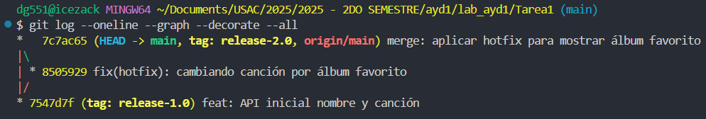
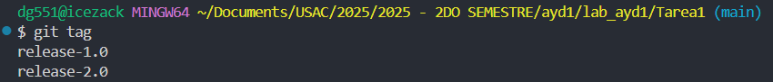
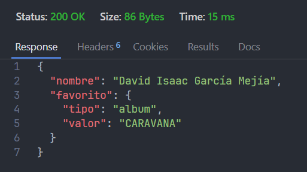

# Tarea #1 — Repositorios públicos y tags

## API
- Endpoint: `/` (GET)
- Respuesta **release-1.0**: nombre + **canción**
- Respuesta **release-2.0**: nombre + **álbum**

## Flujo de Git
1. `git tag -a release-1.0 -m "Versión inicial: nombre + canción"`
2. `git checkout -b hotfix`
3. Cambiar a álbum, commit
4. `git checkout main && git merge --no-ff hotfix`
5. `git tag -a release-2.0 -m "Corrección: nombre + álbum"`
6. `git branch -d hotfix && git push origin --delete hotfix`

### Capturas
- `git log --oneline --graph --decorate --all`

- `git tag`

- Eliminación de la rama `hotfix`

- Respuesta de la API

## Repositorio
https://github.com/ICEZACK1028/ayd_tarea1_202202077 
